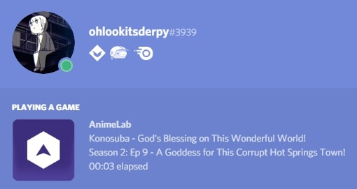

# MediaRPC

Discord RPC for some online video/audio sites

## Supported Sites
* [niconico](https://www.nicovideo.jp)
* [BBC iPlayer](https://www.bbc.co.uk/iplayer)
* [Newgrounds](https://www.newgrounds.com)
* [AnimeLab](https://www.animelab.com)

Want a site adding? Open an issue [here](https://github.com/ohlookitsderpy/MediaRPC/issues/new?assignees=&labels=enhancement&template=new-site.md&title=)!

## Installation 
### Requirements
* Tampermonkey (or similar extension) (OPTIONAL)
* Chrome (OPTIONAL, USED INSTEAD OF TAMPERMONKEY)
* Node.js (and PM2 installed globally)
* Discord Desktop

### Node Process
1. ``git clone https://github.com/ohlookitsderpy/MediaRPC`` (or just click **Clone or download** -> **Download ZIP**)
2. ``cd MediaRPC``
3. ``yarn install`` or ``npm install`` (yarn best btw)
4. ``pm2 start index.js --name MediaRPC``

### Userscript
1. Go to https://github.com/ohlookitsderpy/MediaRPC/raw/master/mediarpc.user.js
2. Click **install**

### Extension
1. Visit ``chrome://extensions`` in Chrome
2. Click **Load unpacked** (Make sure **Developer Mode** is on)
3. Go to the directory containing MediaRPC/extension and click **ok**

## Screenshot

